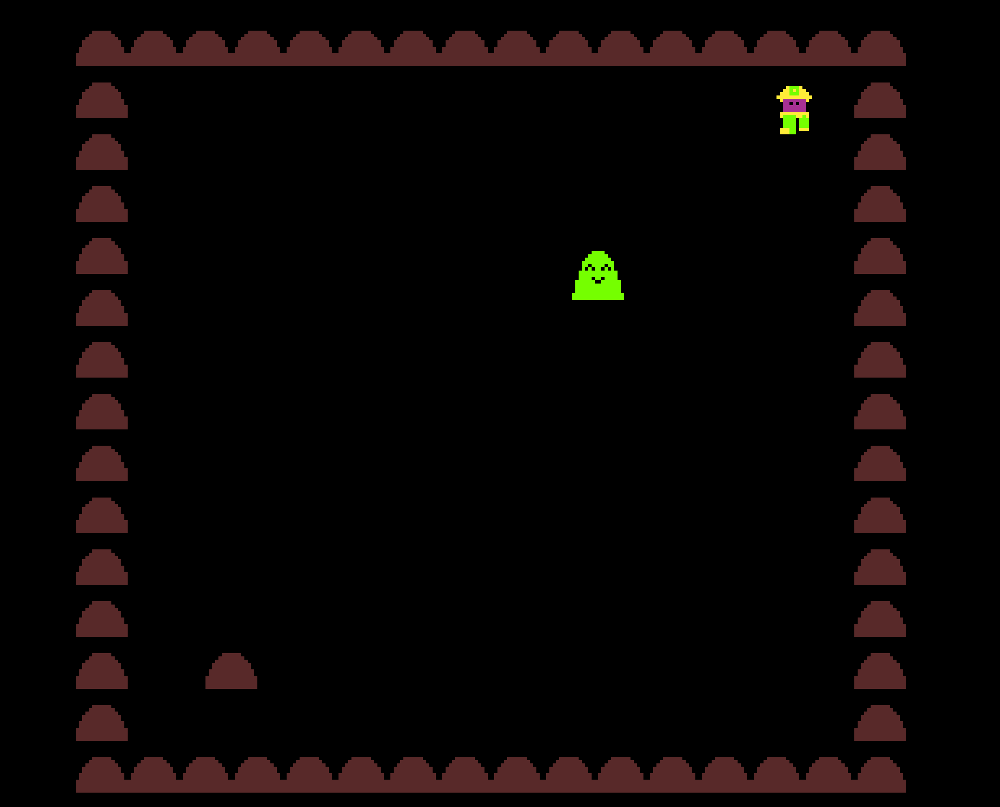

# Slime

Author: Aria Zhang

Design: You are down in the mines when you spot many slimes around you. Clear out the slimes by pushing rocks at them!

Screen Shot:

How Your Asset Pipeline Works:

Create a 16x16 pixel png file => put it in the dist folder => parse out all the colors used in the png, create a mapping between each color and a tile layout. Then create a sprite for each color and layer them ontop of each other.

How To Play:

Use WASD to move, push rocks to clear out the harmless slimes.

This game was built with [NEST](NEST.md).

